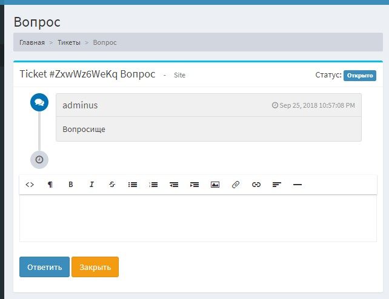

# Yii2 Support   

Yii2 Support Ticket System - simple, flexible module for Yii2 advanced template (frontend/backend apps)

The latest version includes following features:

* very easy, simple and **fast** (only 3 tables: category, ticket, messages)
* Tickets has title, category, priority, users email and name, can link user id
* Module can **parse mailbox** and automatically add new tickets (or add new messages to ticket)
* Auto close tickets after 7 days of inactivity (by cron or backend app)
* Ticket management (in backend app - admin users can use [Redactor Widget](https://github.com/yiidoc/yii2-redactor))
* Console commands (`yii support/ticket/close`)
* ID of ticket are [**hashed**](https://packagist.org/packages/hashids/hashids)
* Compact SEO URL rules
* Module use [yii2-queue](https://github.com/yiisoft/yii2-queue) for background and cron jobs (Sync queue by default, you can use DB, Redis or other)
* Module can use **independent Mailer** component, own config (smtp, user, pass)
* Multi-lingual (en, ru)
* You can use own style css
* Can replace real username(login) of Support (configurable)
* MongoDB

> **NOTE:** Module is in initial development. Anything may change at any time.

## Documentation

[Read the Documentation](docs/README.md)

## Installation

All installation instructions are located in documentation / [Installation](docs/getting-started.md).

## TODO

* write documentation (configuration, faq)
* refactoring Mongodb
* add more languages (cn)
* more console commands
* rest controllers for api app
* view theme (blue, red, green, gray, dark, etc)
* improve from simple to powerful (customer portal or support center like a pro)
* **RBAC** integration (role support manager)
* **tests**!!!
* check ticket status for users
* assignment other manager
* attachments (files, documents, images)
* statistic
* Multichannel ticketing
* more notifications (push, telegram, viber, whatsapp, wechat)

## Support

If you have any questions or problems with Yii2-ticket-support you can ask them on email `akiraz@bk.ru`.

## Contributing to this project

Anyone and everyone is welcome to contribute. Please take a moment to
review the [guidelines for contributing](.github/CONTRIBUTING.md).

## License

Yii2-ticket-support is released under the MIT License. See the bundled [LICENSE.md](LICENSE.md)
for details.
